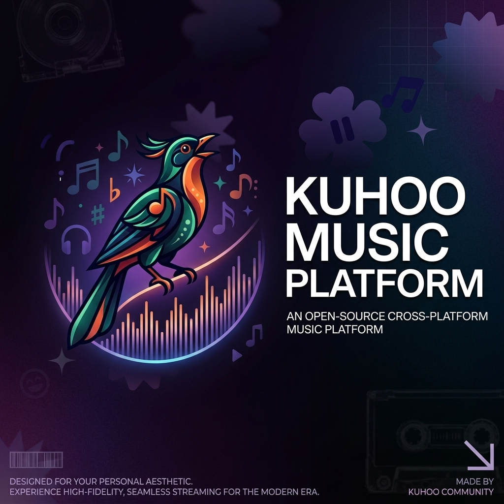

  
   
  <h1>Kuhoo Music Platform</h1>
  <h3>More Than Just Music — Your Ultimate Cross-Platform Audio Experience</h3>

  

    
    
    
  

<h2>🎵 About Kuhoo</h2>

<table align="center" width="100%">
  <tr valign="middle">
    <td width="60%" align="left">
      
✨ <b>Kuhoo</b> is a high-performance Compose Multiplatform audio application engineered for listeners on <b>Windows Desktop (.exe)</b> and <b>Web (WebAssembly / WasmJS)</b>. Powered by a responsive design engine that dynamically matches your album art's color palette, Kuhoo shifts to match your aesthetic on every single beat.

      
From stunning animated canvas visualizers to fluid physics-based micro-animations, every interaction is crafted to elevate your listening. Stream ad-free, sync karaoke lyrics, share your sound instantly, and enjoy an elegant interface designed with modern Expressive Material 3 guidelines.

      <blockquote>
        <b>🎵 Welcome to the Kuhoo Music Platform.</b>
      </blockquote>
    </td>
    <td width="40%" align="center">
      
🛡️ <b>100% Privacy-First & Offline Caching</b> <small>Completely local database via SQLDelight. Absolutely zero trackers, analytics, or background telemetry.</small>

    </td>
  </tr>
</table>

<h2>👨‍💻 Lead Developer & Author</h2>

- **Author**: Sai Dheeraj Nalkari ([@nsd999](https://github.com/nsd999))
- **Email**: nalkarisaidheeraj@gmail.com
- **Repository**: [https://github.com/nsd999/Kuhoo](https://github.com/nsd999/Kuhoo)

<h2>🚀 Key Features</h2>

- **Compose Multiplatform**: Windows Desktop (.exe standalone installer) & Web (WasmJS) targets.
- **YouTube & YT Music Integration**: Ad-free streaming background player with full catalog search.
- **Animated Canvas Visualizers**: Dynamic Skia/Compose drawing routines.
- **Synchronized Karaoke Lyrics**: Timed line scrolling and word highlight animations.
- **Local SQLDelight Database**: Fast offline caching for downloaded tracks.

  
© 2026 Kuhoo Music Platform. Developed by Sai Dheeraj Nalkari (nsd999).

